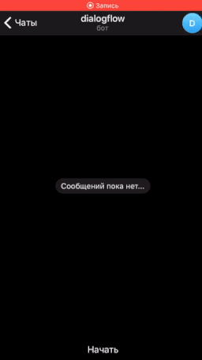

# dialogflow_bot

This bot can make simple dialog with user & answer on the fix list of questions, using dialogflow api. 
Demo for Telegram & VK:

 

You can interact with bot by yourself:
Telegram - @dialog348_bot
VK - https://vk.com/club191375658

To make your own intents, use ```neurolearn.py``` and your correct structured json file as the argument, in the commanline type: ```python neurolearn.py -file yourfile.json```
